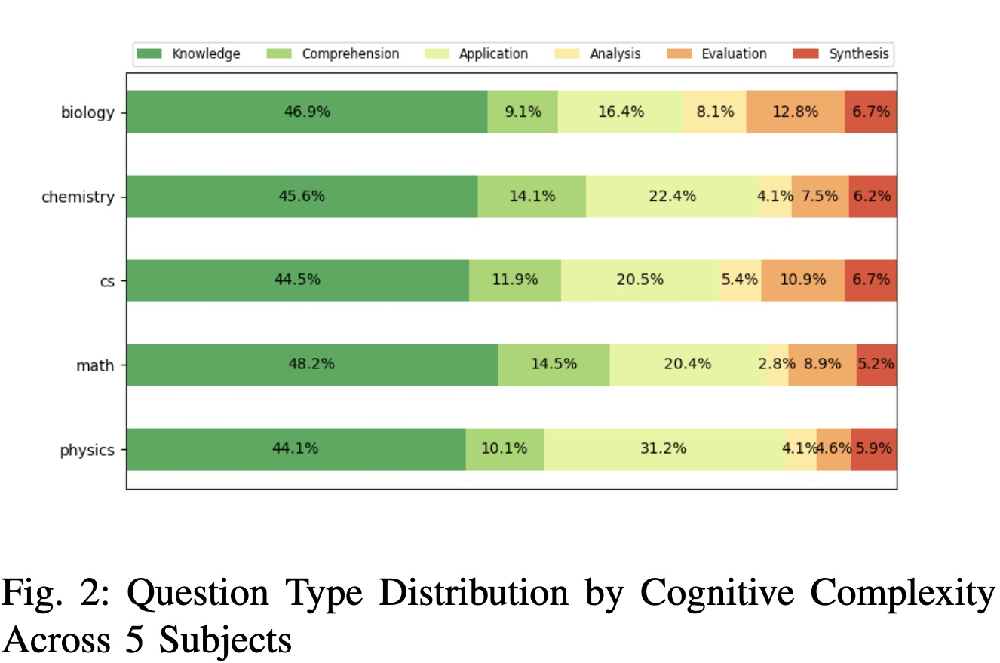

# YouLeQD: YouTube Learners' Questions on Bloom's Taxonomy Dataset 
## Introduction
YouTube Learners' Questions on Bloom's Taxonomy Dataset (YouLeQD) is a dataset that contains 57,242 learner-posed questions from YouTube educational lecture video comments. Along with the dataset, we developed two RoBERTa-based classification models leveraging Large Language Models to detect questions and analyze their cognitive complexity using Bloom's Taxonomy. This dataset and our findings provide valuable insights into the cognitive complexity of learner-posed questions in educational videos and their relationship with interaction metrics. This can aid in the development of more effective AI models for education and improve the overall learning experience for students. 
 

## Data Sources
Questions are extracted from the comments of these educational videos in the [video list](https://docs.google.com/spreadsheets/d/1QAVrbPnitRay5iqdkrJ8Mk1jM1OUktPitVkXRi5tERk/edit?gid=17187986#gid=17187986) 
## Methodology
### Question Extraction
To distinguish questions from users' comments, we fine-tune a model on a publicly available dataset for interrogative sentence classification, which is built upon other datasets such as [SQuAD](https://arxiv.org/abs/1606.05250) and [SPAADIA](https://martinweisser.org/publications/SPAADIA_Annotation_Scheme.pdf). The dataset comprises 211,168 sentences, including 80,167 non-interrogative sentences and 131,001 interrogative sentences,each with binary labels. The author of the dataset has deliberately removed question marks from some of the examples inorder to prevent the model from overfitting to the punctuation marks.To access the dataset, navigate to the file located at `data/IntVsDecl/questions_vs_statements_v1.0.csv` or [click here](https://www.kaggle.com/datasets/shahrukhkhan/questions-vs-statementsclassificationdataset) for visit.
### Bloom Taxonomy Levels of Questions extracted from Youtube Educational Video Comments
`data/q_bt_pred.csv` are predictions of Bloom Taxonomy Levels of Questions extracted from Youtube Educational Video Comments.
`scripts/bt_cls_roberta.py` is the python script used for BT level prediction.
<div align="center">

</div>
## Citation
This paper was selected for presentation at the 19th **International Conference on SEMANTIC COMPUTING (ICSC 2025) **, held in Laguna Hills, California.
If you find our work helpful or interesting, we would appreciate it if you consider citing it!

```
@inproceedings{nong2025YouLeQD,
  title= {YouLeQD: Decoding the Cognitive Complexity of Questions and Engagement in Online Educational Videos from Learners' Perspectives},
  author={Nong Ming, Sachin Sharma, Jiho Noh},
  year={2025}
}
```
